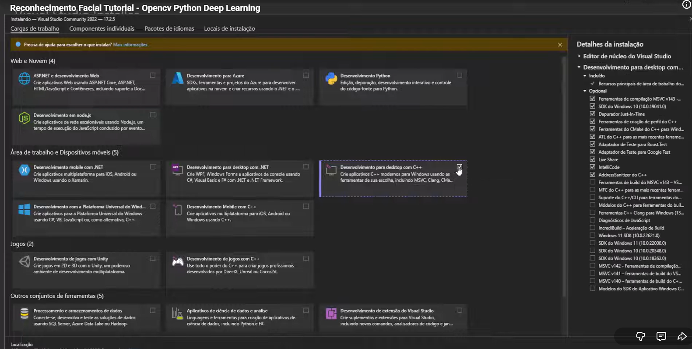

# IA_HarryPotter
Detector de rostos que identifica os personagens em um trecho do filme Harry Potter e a Pedra Filosofal

### Baixar e configurar Microsoft Visual Studio
Para que o projeto funcione corretamente, é necessário utilizar baixar a biblioteca dlib pré-compilada compativel com a versão do python que está usando para rodar no seguinte link:
https://github.com/z-mahmud22/Dlib_Windows_Python3.x

Após isso entre dentro do diretório da pasta que está o arquivo ".whl" e de um pip install nele conforme demonstrado na imagem:

Perceba que a versão que peguei do dlib foi para a verção 3.9 do python, sinalizada por "cp39" no arquivo.

Após isso instale as bibliotecas que estão no "requirements.txt" e pronto! Pode rodar normalmente os códigos!